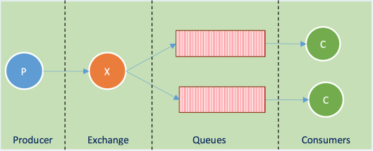
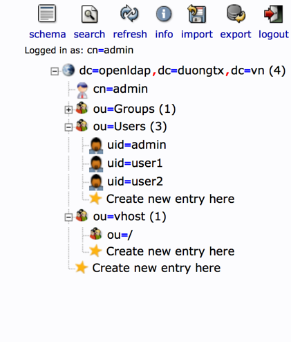

## Tổng quan về rabbitmq

1. Rabbitmq: RabbitMQ là một bộ phần mềm mã nguồn mở sử dụng giao thức AMQP (Advanced Message Queuing Protocol) phục vụ cho hệ thống gửi nhận bản tin message – oriented middleware ( hay message broker). Máy chủ RabbitMQ được viêt bằng ngôn ngữ Erlang. Các thư viện để client giao tiếp với broker được hỗ trợ trên hầu hết các ngôn ngữ (C#, C++, Java, Python, PHP, NodeJS, Objective-C…).

2. Thành phần:

Producer: thực hiện quá trình gửi bản tin lên RabbitMQ server.
Queues: có nhiệm vụ lưu trữ bản tin được gửi lên .
Consumber: thực hiện việc lấy các bản tin từ queue về.
Exchange: thực hiện nhiệm vụ phân phối bản tin, có 3 kiểu phân phối bản tin direct, topic, fanout.
                  
         Fanout (broadcast): Exchange sẽ gửi cho toàn bộ các queue đã được đăng ký
         Direct (unicast): gửi trực tiếp. [Queue (routingKey1)] chỉ nhận được các bản tin có chứaroutingKey1.
         Topic (multicast): gửi theo nhóm
         

## Install: Erlang + Rabbitmq:

1.  Erlang:
+ Nếu cài từ repo epel được bản: erlang-erts-R16B-03.18.el7. Bản này là bản khá cũ, cài rabbit-mq sẽ bị lỗi ngay, vậy cần xóa mà xóa. Nhưng khi xóa nó bằng yum remove erlang thì chỉ xóa các nó và các gói phụ thuộc,vậy thì làm sao mất được các file đi cùng.

B1: xác định các file của nó bằng lệnh: rpm -ql (query_file) <name_package>

         rpm -ql rpm -ql erlang-erts-R16B-03.18.el7

B2: Sau khi xác định thì xóa bằng tay hoặc cài mới package lên và replace nó: 

         rpm -ivh --replacefiles <package.rpm>

2. Cài đặt:

         curl -s https://packagecloud.io/install/repositories/rabbitmq/erlang/script.rpm.sh | sudo bash
         sudo yum install erlang-20.2.2-1.el7.centos.x86_64
         # Select phien ban: https://packages.erlang-solutions.com/erlang/

3. Rabbitmq:
           
           yum install socat -y
           wget https://dl.bintray.com/rabbitmq/all/rabbitmq-server/3.7.5/rabbitmq-server-3.7.5-1.el7.noarch.rpm
           yum install rabbitmq-server-3.7.5-1.el7.noarch.rpm

4. Start service

           service rabbitmq-server start
           cp /usr/share/doc/rabbitmq-server-3.5.2/rabbitmq.config.example /etc/rabbitmq/
           mv /etc/rabbitmq/rabbitmq.config.example  /etc/rabbitmq/rabbitmq.config
           
 5. Kích hoạt web giao diện
 
Rabbitmq có đi kèm một plugin cho phép quản trị hoạt động qua một web interface trông rất trực quan và thân thiện. Nhưng mặc định, plugin này không được enable thực hiện lệnh sau:

         rabbitmq-plugins enable rabbitmq_management
         
6. Thêm user để đăng nhập:

Add user: Mặc định khi cài đặt, hệ thống sẽ có một user quản trị mặc định với Username và Password là guest.
Tạo user mới có tên là admin, password là adminvà nâng quyền Admin cho nó như sau:

         sudo rabbitmqctl add_user admin[<username>] admin[<password>]

Set tags: nâng lên quyền Administrator

         sudo rabbitmqctl set_user_tags admin[<username>] management

Set permission for user with vhost:

         sudo rabbitmqctl set_permissions admin[<username>] ".*" ".*" ".*"

Xóa user 

         rabbitmqctl delete_user admin

Quant-edge
    
          sudo rabbitmqctl add_user qe.dev 123
          sudo rabbitmqctl set_user_tags qe.dev administrator
          sudo rabbitmqctl set_permissions -p / qe.dev ".*" ".*" ".*" 

### Cấu hình:
File cấu hình mẫu trong cty:

           [
           {rabbit, [{auth_backends, [{rabbit_auth_backend_http,rabbit_auth_backend_internal},rabbit_auth_backend_internal]},
                     {tcp_listeners, [{"10.0.25.233",5670}]},
                     {ssl_listeners, [{"10.0.25.233",5671}]},
                     {ssl_options,   [{cacertfile,            "/etc/rabbitmq/ssl/nvca/cacert.pem"},
                                      {certfile,              "/etc/rabbitmq/ssl/server/cert.pem"},
                                      {keyfile,               "/etc/rabbitmq/ssl/server/key.pem"},
                                      {password,              "Abc123456"},
                                      {verify,                verify_none},
                                      {fail_if_no_peer_cert,  false}
                                     ]
                     },
                     {heartbeat,                              100},
                     {vm_memory_high_watermark_paging_ratio,  0.75},
                     {vm_memory_high_watermark,               0.75},
                     {disk_free_limit,                        10000000000},
                     {loopback_users,                         []}
                   ]
           },

           {rabbitmq_stomp, [
             {tcp_listeners, [61613]},
             {ssl_listeners, [61614]}
           ]},

           {rabbitmq_web_stomp,
             [{port,        5010},
              {ssl_config, [{port,       5011},
                            {backlog,    1024},
                            {cacertfile, "/etc/rabbitmq/ssl/nvca/cacert.pem"},
                            {certfile,   "/etc/rabbitmq/ssl/server/cert.pem"},
                            {keyfile,    "/etc/rabbitmq/ssl/server/key.pem"},
                            {password,   "Abc123456"}]}
             ]
           },

           {rabbitmq_management,
             [{listener, [{port,       8443},
                          {ssl,        true},
                          {ssl_opts, [{cacertfile, "/etc/rabbitmq/ssl/nvca/cacert.pem"},
                                      {certfile,   "/etc/rabbitmq/ssl/server/cert.pem"},
                                      {keyfile,    "/etc/rabbitmq/ssl/server/key.pem"},
                                      {password,   "Abc123456"}]}
                         ]
             }]
           },
           {rabbitmq_auth_backend_http,
                 [{http_method, post},
                         {user_path, "http://10.0.25.233:8081/auth/user"},
                         {vhost_path, "http://10.0.25.233:8081/auth/vhost"},
                         {resource_path, "http://10.0.25.233:8081/auth/resource"}]}
         ].

### Một số lệnh cơ bản

* 1. Lệnh liên quan đến rabbitmqctl

          rabbit# rabbitmqctl status

          rabbit# rabbitmqctl cluster_status

          rabbit# rabbitmqctl list_queues

          rabbit# rabbitmqctl list_users

          rabbit# rabbitmqctl list_exchanges
          
          rabbit# rabbitmqctl start_app/stop_app # start hoặc stop node đang chạy. 

          rabbit# service rabbitmq-server stop/start/reset

* 2. Lệnh liên quan đến rabbitmq-plugins

           rabbitmq-plugins list # danh sách các plugins đang dùng 
            
           rabbitmq-plugins enable/disable [plugin_name] # kích hoạt hoặc hủy các plugins 
           Ex: rabbitmq-plugins enable rabbitmq_management. 
          
           rabbitmq-plugins set [name_plugins] # Bật các plugin được chỉ định và tất cả các phụ thuộc của chúng. Không giống như enable, lệnh này bỏ qua và ghi đè bất kỳ plugin đã bật nào hiện có. Khi thiết lập không có tham số plugin thì nó sẽ "vô hiệu hóa tất cả các plugin". 

          
 ### Thành phần file cấu hình
 
* File rabbitmq-env.conf là file chứa thông tin cấu hình về node name và đường dẫn config có nội dung sau:

          #example rabbitmq-env.conf file entries

          #Rename the node

          RABBIT_NODENAME=rabbit@myhost

          #Config file location and new filename bunnies.config

          RABBIT_CONFIG_FILE=/etc/rabbitmq/rabbit.config
          
* File rabbit.config là file chứa các thông tin cấu hình khi khởi tạo dịch vụ rabbitmq-server. File config căn bản:

          [

          {rabbit, 

              [{auth_backends,[rabbit_auth_backend_internal]},

               {default_permissions,[<<".*">>,<<".*">>,<<".*">>]},

               {default_user,<<"guest">>},

               {default_user_tags,[administrator]},

               {default_vhost,<<"/">>}

              ]}

          ].
  
### Update lại cấu hình

Các bước update lại cấu hình của server RabbitMQ:

        rabbit# service rabbitmq-server reset

        rabbit# rabbitmqctl environment
        
(Check lại cấu hình thay đổi)

### Bật chức năng quản lý RabbitMQ Server trên giao diện web.

      rabbitmq-plugins enable rabbitmq_management
      
Truy cập địa chỉ https://localhost:15672/, đăng nhập với tài khoản guest/guest.

Cấu hình SSL: vào file cấu hình rabbit.config bổ sung cấu hình rabbitmq_management như sau:

        [{rabbitmq_management,

          [{listener, [{port,     15672},

               {ssl,      true},

               {ssl_opts, [{cacertfile, "/path/to/cacert.pem"},

                           {certfile,   "/path/to/cert.pem"},

                           {keyfile,    "/path/to/key.pem"}]}

              ]}

            ]}

          ].
  
 ### Cấu hình xác thực LDAP:
 
 Bước 1: Enable LDAP: 
 
            rabbitmq-plugins enable rabbitmq_auth_backend_ldap
 
 Bước 2: Cấu hình trong file config sử dụng xác thực LDAP
 
             rabbit,[{auth_backends, [rabbit_auth_backend_ldap, rabbit_auth_backend_internal]}]}
             
Bước 3: Cấu hình LDAP:
Với: 
    *  Servers: địa chỉ server ldap.
    *  Port: cổng kết nối server.
    * User_dn_pattern: cấu hình map thông tin tài khoản với ldap, giá trị username được lấy ra bằng từ khoá ${username}.
    * Log: bật chức năng log khi đăng nhập (true/false/network).
    * Use_ssl: bật chức năng ssl.
    * Tag_queries: set quyền sử dụng administrator và management.
              

    {rabbitmq_auth_backend_ldap,

     [  {servers,            ["192.168.6.8"]},

     {port,                  389},

     {user_dn_pattern, "uid=${username},ou=Users,dc=openldap,dc=elcom,dc=com,dc=vn"},

     {log,                   network},

     {use_ssl,               false},

     {tag_queries, [{administrator, {constant, true}},

                   {management,    {constant, true}}]}

      ]}

    ].
    
Bước 4: Reset lại service

Bước 5: Cấu hình LDAP server:

+ Tạo Users group: DN: ou=Users,dc=openldap,dc=elcom,dc=com,dc=vn.
+ Add các thông tin tài khoản, username là trường uid.

+ Tạo Virtual hosts group: DN: ou=vhost,dc=openldap,dc=elcom,dc=com,dc=vn.
+ Add Organisational Unit tên là đường dẫn virtual hosts.\

